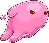

# Dante needs love

# ***[Link para jugar al juego!](https://lorenalario.github.io/Dante-needs-love/)***

## **Logo del juego :**

# ***Descripción del juego:***

Dante needs love es un juego donde tienes que ayudar a una bonita gelatina a recoger corazones por diferentes niveles, cada cual más complicado donde te enfrentarás a rayos y pinchos cada vez más rápidos. Tu objetivo es terminar el juego entrando en el ranking del final, haciéndote con la victoria absoluta.

# ***Funcionalidades principales:***

- Dante se puede mover a la izquierda (a) o a la derecha (d).
- Además el personaje puede saltar usando el espacio y el click del ratón, lo que facilita el juego en móviles.
- Hay un contador de puntos en la parte de arriba de la pantalla que va indicando al usuario del juego los puntos que lleva.
- El juego consta de 3 niveles. En el primer nivel solo aparecen unos pinchos entre los cuales tienes que saltar para reunir suficientes puntos para poder pasar de nivel.
- En el nivel 2 la cosa se complica un poco más. En este siguen apareciendo pinchos, pero algo más separados. Además se implementan los rayitos, los cuales aparecen de uno en uno y aquí será donde hay que empezar a usar las teclas a y d para moverse porque como te toquen mueres inmediatamente.
- En el nivel 3 se vuelve un poco más difícil. La separación de los pinchos sigue vigente, pero los rayitos caen algo más rápido y más a la vez.
- La puntuación que consigues se ve al final del juego en un ranking, el cual se guarda localmente. Solo se ven las 3 mejores puntuaciones.

# ***Funcionalidades por implementar:***

- Añadir diferentes niveles más en los que la dificultad sea aún más alta.
- Implementar tres vidas, para así tener más oportunidades de avanzar sin morir.
- Mejorar el ranking del final.
- Meter más obstáculos en esos nuevos niveles.

# ***Tecnologías utilizadas:***

- HTML
- CSS
- JavaScript
- Manipulación de DOM
- JS Canvas
- JS Clases
- Local Storage
- JS Audio

# *Estados:*

- Pantalla de inicio
- Pantalla de Canvas donde está el juego
- Pantalla de Game Over

# ***Estructura del proyecto:***

### SuperMain.js

- startGame()
- playAgain()

### Game.js

- Game ()
    - constructor()
    - drawBackground()
    - gameOver()
    - pinchosEnPantalla()
    - pinchosEnPantallaNivel2()
    - corazonesEnPantalla()
    - corazonesEnPantallaNivel2()
    - rayitosEnPantalla()
    - rayitosEnPantallaNivel3()
    - colisionDantePincho()
    - colisionDanteCorazon()
    - colisionDanteRayito()
    - dibujadoPuntuacion()
    - danteNoSeSale()
    - logicaNivel1()
    - logicaNivel2()
    - logicaNivel3()
    - empiezaNivel2()
    - empiezaNivel3()
    - terminanNiveles()
    - limpiezaCanvas()
    - almacenarRanking()
    - gameLoop()

### Dante.js

- Dante()
    - constructor()
    - draw()
    - jump()
    - imgSaltando()
    - haciaAtras()
    - haciaDelante()
    - pasitoDFluido()
    - pasitoIFluido()
    

### Pincho.js

- Pincho()
    - constructor()
    - draw()
    - pinchosSeMueven()

### Rayito.js

- Rayito()
    - constructor()
    - draw()
    - rayitosCaen()
    - rayitosCaen2()

### Corazon.js

- Corazon()
    - constructor()
    - draw()
    - corazonesSeMueven()

# *Links Extra:*

### [Slice](https://www.canva.com/design/DAFhYe3ePtc/qBgcC2mGoZ7oAlSrbZSEbA/view?utm_content=DAFhYe3ePtc&utm_campaign=designshare&utm_medium=link&utm_source=publishsharelink)